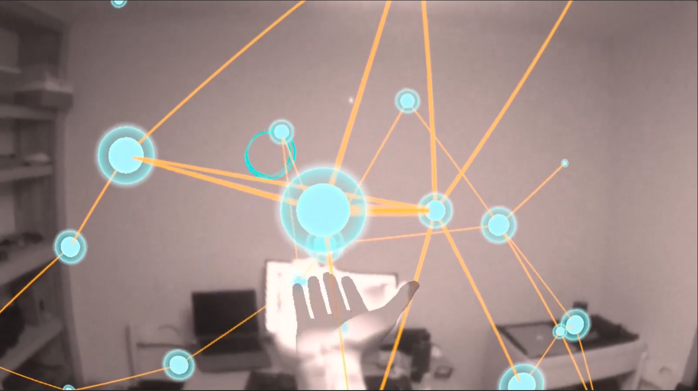

# XR Audio VFX 

A project exploring relationships between visual effects and audio in mixed reality settings that incorporate hand tracking and physics-based interactions in Unity.

## Audio Reactive Explorations

- Scale
- Velocity
- Rotation
- Shader Parameters
    - Vertex displacement
    - Color changes
- VFX Parameters
    - Simulation speed
    - Color
    - Number of particles
    
## Physics Interactions

- The majority of the objects that make up the interactions have rigidbodies, and can be physically interacted with via hand tracking
- The walls of my room have also been mapped to allow for physics based interactions with the environment.

## Things to Note

This repo is under construction. I'm switching it from the Oculus Integration SDK to Unity's XR Interaction Toolkit, as it now supports hand tracking and it will allow this project to run on multiple devices. That being said, builds will not run as is right now. You can still take a look at the main node effect in Unity in the NodeGroup scene 

